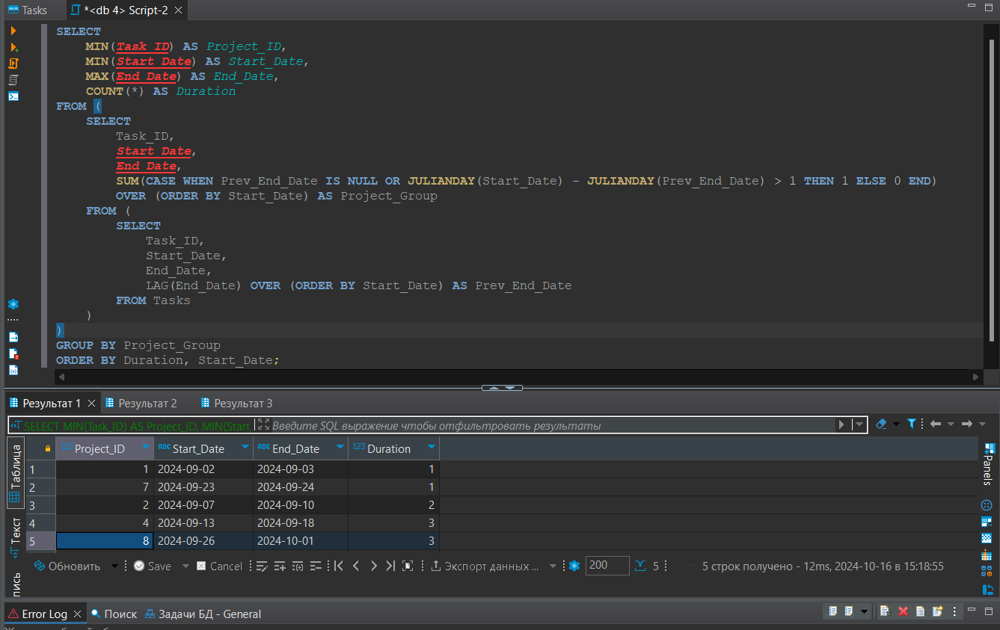

# Задание на знание SQL (2)

## Описание

Дана таблица Projects, в которой содержатся данные о начале и завершении задач. Длительность 1 задачи равна 1 дню. Если задачи выполняются подряд, они относятся к 1 проекту.

## Задача


Напишите запрос для вывода дат начала и окончания проектов в порядке возрастания количества дней, которые потребовались для завершения проекта. Если существует несколько проектов с одинаковым количеством дней завершения, упорядочивайте их по дате начала проекта. 

## РЕШЕНИЕ

1. Создадим игрушечную БД в Python:

   ```python.

        import datetime
        import random
        import sqlite3
        import numpy as np
        import pandas as pd

        task_id = np.arange(1, 11)
        start_date = []
        end_date = []
        initital_date = datetime.date(2024, 9, 2)

        current_start_date = initital_date
        for i in range(10):
            start_date.append(current_start_date)
            current_end_date = current_start_date + datetime.timedelta(days=1)
            end_date.append(current_end_date)
        
            gap = random.choice([1, random.randint(2, 5)]) #Разрыв между задачи 1 день или случайно от 2 до 5

            current_start_date = current_end_date + datetime.timedelta(days=gap)

        Tasks = pd.DataFrame(columns=['Task_ID', 'Start_Date', 'End_Date'])
        Tasks['Task_ID'] = task_id
        Tasks['Start_Date'] = start_date
        Tasks['End_Date'] = end_date

        Tasks['Start_Date'] = pd.to_datetime(Tasks['Start_Date'], format='%Y-%m-%d')
        Tasks['End_Date'] = pd.to_datetime(Tasks['End_Date'], format='%Y-%m-%d')
        Tasks['Start_Date'] = Tasks['Start_Date'].dt.strftime('%Y-%m-%d')
        Tasks['End_Date'] = Tasks['End_Date'].dt.strftime('%Y-%m-%d')

        con = sqlite3.connect('C:/Users/79504/Desktop/Projects/Test2/db', timeout=10) 
        cur = con.cursor()
        Tasks.to_sql(con=con, name='Tasks', index=False, if_exists = 'replace')
        data_test = cur.execute('select * from Tasks') #тестовый запрос
        con.commit() 
        cur.fetchall() 
    
2. Откроем её в DBeaver и напишем соответствующий запрос:

```sql
SELECT 
    MIN(Task_ID) AS Project_ID,
    MIN(Start_Date) AS Start_Date,
    MAX(End_Date) AS End_Date,
    COUNT(*) AS Duration
FROM (
    SELECT 
        Task_ID,
        Start_Date,
        End_Date,
        SUM(CASE WHEN Prev_End_Date IS NULL OR JULIANDAY(Start_Date) - JULIANDAY(Prev_End_Date) > 1 THEN 1 ELSE 0 END) 
        OVER (ORDER BY Start_Date) AS Project_Group
    FROM (
        SELECT 
            Task_ID,
            Start_Date,
            End_Date,
            LAG(End_Date) OVER (ORDER BY Start_Date) AS Prev_End_Date
        FROM Tasks
    )
)
GROUP BY Project_Group
ORDER BY Duration, Start_Date;
```
## Результаты выполнения запроса


